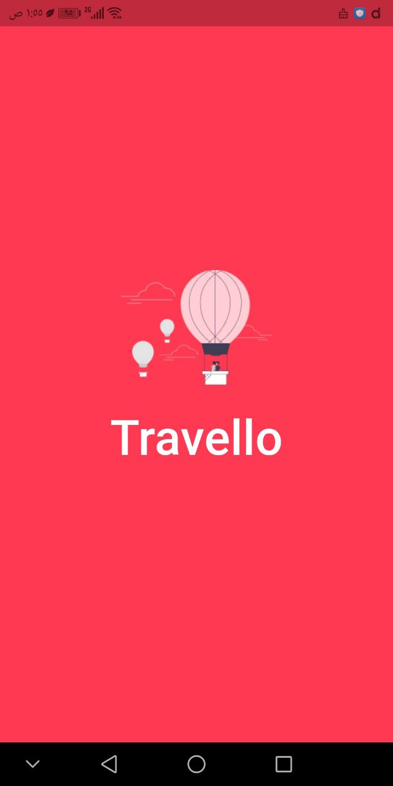
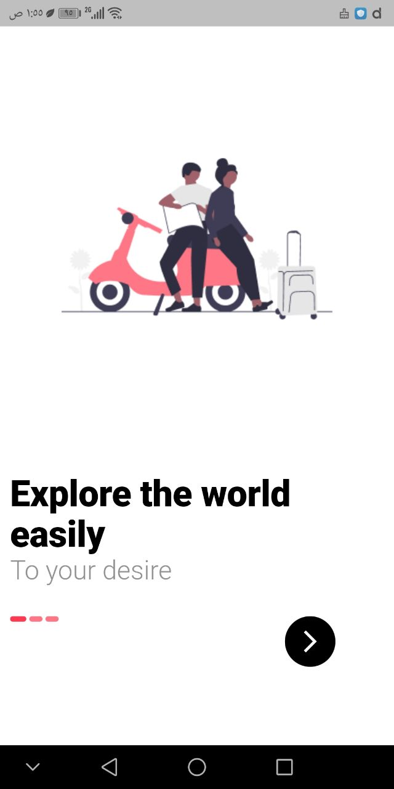
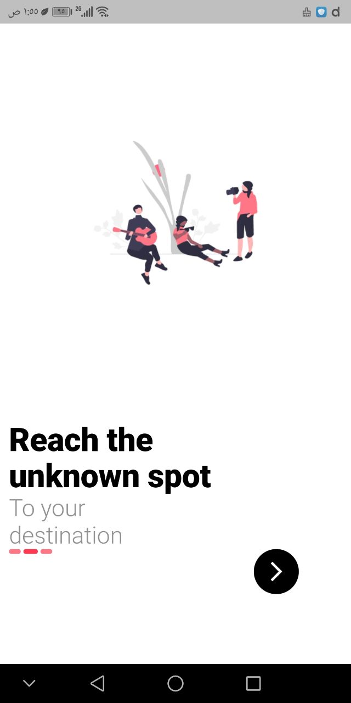
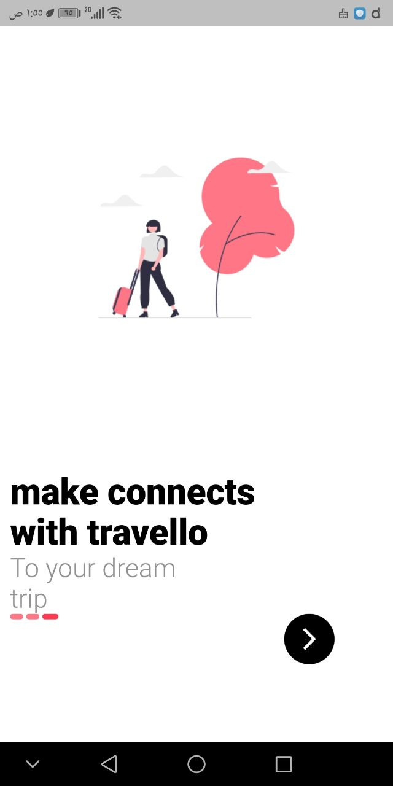
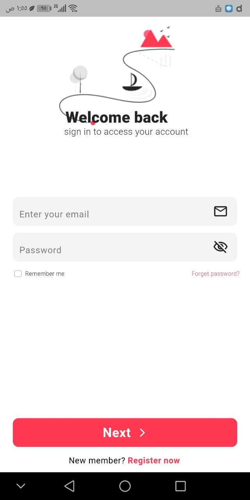
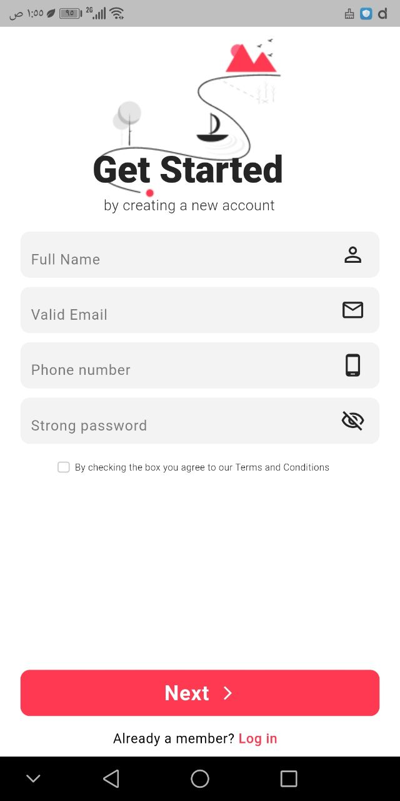

# 🌍 Travello - Modern E-Commerce & Travel Mobile App (v2 Refactored)

A high-fidelity, scalable Flutter mobile application demonstrating senior-level architecture, responsive UI execution, server-side pagination, and seamless integration with **Supabase BaaS**.

---

## 🚀 Architectural & Technical Improvements

This repository represents the **V2 Architecture Refactor** of the Travello application. Key engineering highlights include:

* **Clean Separation of Concerns (SoC):** Decoupled UI components from business logic and network API callers via Service and Provider patterns.
* **Server-Side Pagination & Dynamic Querying:** Optimized memory footprint by fetching datasets in ranges (`_pageSize = 10`) utilizing Supabase's `.range()` and dynamic filter query building.
* **Type-Safe Deserialization:** Robust Model parsing preventing runtime type conflicts (e.g., safe casting for numbers and complex nested JSON arrays like `product_colors`).
* **State Synchronization:** Global state provisioning via `Provider` (`ChangeNotifier`) with selective UI rebuilds.
* **Defensive Exception Handling:** Complete protection against app crashes using async `try-catch` blocks and lifecycle context guards (`mounted` checks).
* **Responsive Layout:** Engineered using `flutter_screenutil` to maintain pixel-perfect design accuracy across various screen densities.

---

## 🛠 Tech Stack

* **Frontend:** Flutter SDK (Dart)
* **Backend as a Service (BaaS):** Supabase (PostgreSQL, Authentication)
* **State Management:** Provider Pattern (`ChangeNotifier`)
* **Responsive Design:** `flutter_screenutil`
* **Custom Navigation:** Custom `PageRouteBuilder` with `FadeTransition`

---

## 📱 Application Screenshots

### Splash & Onboarding

<div align="center">
  
  
  
  
</div>

### Authentication

<div align="center">
  
  
  
  
</div>

### Home & Details

<div align="center">
  
  
</div>

---

## ⚙️ App Initialization & Core Engineering Highlights

### Native Binding & Service Bootstrapping
Guaranteed platform channel initialization before executing asynchronous BaaS calls:
       ```dart
        WidgetsFlutterBinding.ensureInitialized();
        await Supabase.initialize(
        url: 'YOUR_SUPABASE_URL',
        anonKey: 'YOUR_SUPABASE_ANON_KEY',
        );```

### Dynamic Hex Color Deserialization
Parsing server hex-coded strings directly into Flutter-native Color objects:
    ```dart
    Color(int.parse(map['color_code']));```

---
## 💻 Installation
Follow these steps to run the project locally:

Clone the repository:

`git clone https://github.com/Ayaezz1101/travello-app-v2.git`

Navigate to project directory:

`cd travello-app-v2`

Install dependencies:

`flutter pub get`

Run the app:

`flutter run`

---
## 📁 Project Structure
Plaintext
lib/
├── data/           # Static configuration & onboarding static data
├── model/          # Strongly-typed data models (Product, ColorOption)
├── pages/          # View/Screen layer (Splash, Auth, Home, Details)
├── providors/      # Centralized reactive state management (ProductProvider)
├── srvices/        # Auth & API services encapsulation + Custom Transitions
├── theme/          # App ThemeData & design constants
└── wigets/         # Atomic modular UI components (Cards, TextFields, Buttons)

---